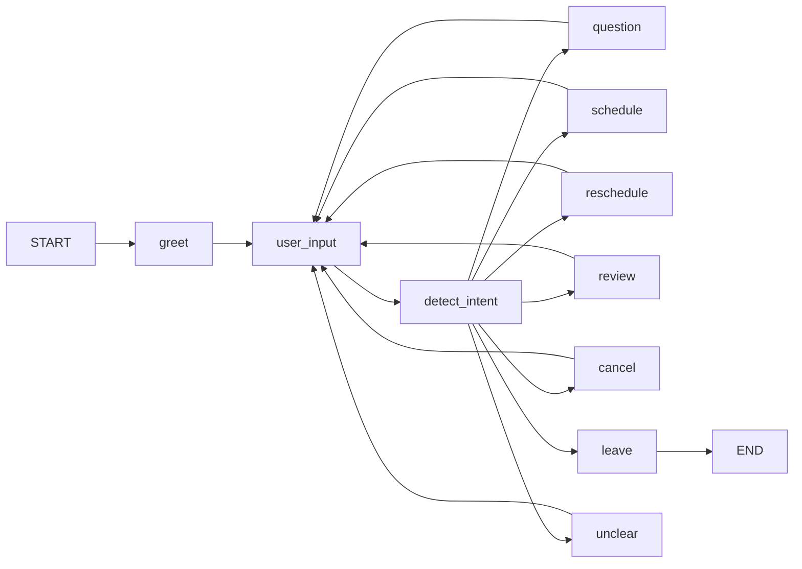

# Acme Dental AI Agent

## Solution Notes

### Overview

The solution is based on the guidelines provided in the following part of this file.
The provided non-functional requirements dictated using `LangChain` and `Calendly`.
The agent should be constructed using `LangGraph`.

#### Solution structure

The solution is presented with the following folder structure:

```
acme-dental-main
├─ src
│  ├─ api
│  ├─ tools
│  └─ prompts
```

- **api** contains wrappers to external services (e.g. Calendly)
- **tools** contains LangChain tool implementations, mostly interfacing with external services
- **prompts** contains prompts we rely on for our system behavior

### Current design choices

#### Agent structure

- `LangChain` tools were implemented to use the Calendly wrapper and a preliminary KB dataset.
- A customised `LangGraph` was written by following the online documentation. The graph is branching to different nodes based on the client intent.
- The tools are grouped for each intent node for better scoping.
- System messages are intent-specific.



##### **TODO**

- [ ] A better representation of state will probably help with predictability.
- [ ] Tools data that can be cached should be cached.
- [ ] The KB should be an external data set that can be managed by the user.
- [ ] User input via `interrupt()` can probably be better.
- [ ] Tools are currently synchronous. It may be better to make some `asynchronous` and have the graph support communicating with the user in the meantime.

#### Calendly API
To access Calendly, an API wrapper class was generated using a coding agent and
was then hand-customised as needed.

##### **TODO**
- [ ] At the moment, the API access is synchronous, not rate-limited, etc. A better implementation would be to use an asynchronous queue (rpc or local).
- [ ] Data should be represented as TypedDicts.
- [ ] Error handling.

### Testing

An integration testing starter module was staged to validate the agent's trajectory through the tools. The module is using `agentevals` and its llm-as-judge capability (using OpenAI).
Mock tool sets were defined to ensure deterministic tool responses.
Dependencies-injection was implemented in the agent initialisation to reduce code duplication.

##### **TODO**
- [ ] Implement finer-grained unit-tests.
- [ ] Expand the tests for much more coverage. Focus on PII-safety.

### Missing production-grade features (partial list)

#### Reliability

##### **TODO**
- [ ] Restructure to gRPC services.
- [ ] Enable per-service load-balancing / rate-limiting.
- [ ] Basic metrics exporting.
- [ ] Logging backend.

#### Performance & Efficiency

##### **TODO**
- [ ] **TODO:** Cache re-usable responses.

#### Configuration

##### **TODO**
- [ ] Support configuration loading / rollouts.

#### Deployment

##### **TODO**
- [ ] CircleCI / Github / other workflow.
- [ ] Docker / Kubernetes manifests.

#### Billing

- [ ] Collect and process usage metrics.

## Your Task

Build an AI agent that allow users to book dental check-up appointments with a fictitious Acme Dental clinic through natural language conversation in a chat interface.

### The clinic

Acme Dental is a simple dental practice that offers routine check-up appointments. The clinic operates with a single dentist and uses Calendly to manage its appointment scheduling. Below are the key details you'll need to know about the clinic's operations.

**Clinic Information:**
- **Service Type**: Dental Check-up (only service offered)
- **Appointment Duration**: 30 minutes
- **Staff**: Only 1 dentist
- **Scheduling System**: Calendly
  - Calendar URL: Provided in the email.
  - Calendly Token: Provided in the email.
  - Use the Calendly API to check availability and manage bookings

### Functional Requirements

The agent must support the following core booking operations:

**1. Create New Bookings**
- Greet users and understand their booking intent
- Check available appointment slots via the Calendly calendar
- Present available time slots to users
- Help users select a suitable time slot
- Collect necessary patient information (i.e full name and email address)
- Create the booking through the Calendly API
- Provide confirmation with appointment details (date, time, duration)

**2. Reschedule Existing Bookings**
- Allow users to Reschedule their existing appointments
- Identify the booking to update
- Retrieve current appointment details
- Check availability for the new requested time slot
- Reschedule the booking through the Calendly API
- Provide updated confirmation with new appointment details

**3. Cancel Bookings**
- Allow users to cancel their appointments
- Identify the booking to cancel
- Retrieve current appointment details
- Process cancellation through the Calendly API
- Provide cancellation confirmation

**4. Answer FAQs from the Knowledge Base**: 
- A document containing the clinic's knowledge base (KB) will be provided
- Extract and process information from the docu to build a searchable knowledge basent
- Answer frequently asked questions about the clinic using information from the KB

### Non Functional Requirements

- Implement the agent using [LangGraph](https://docs.langchain.com/oss/python/langgraph/overview)
- You are free to choose the LLM model(s) or combination of models you consider most appropriate for this task
- Be aware that API integrations (e.g. Calendly) may be unreliable or experience delays.
- Document your architectural decisions

## Getting Started

### Prerequisites

- Python 3.11 or higher
- [uv](https://github.com/astral-sh/uv) package manager
- Anthropic API key (for Claude models)
- Calendly API token (for booking functionality)

### Installation

1. **Install uv** (if not already installed):

```bash
curl -LsSf https://astral.sh/uv/install.sh | sh
```

2. **Install dependencies**:

```bash
make run
```

or 

```bash
uv sync
```

3. **Set up environment variables**:

Create a `.env` file in the project root and add your API keys:

```
ANTHROPIC_API_KEY=your_anthropic_api_key_here
OPENAI_API_KEY=your_openai_api_key_here
CALENDLY_API_TOKEN=your_calendly_api_token_here
```

### Starting the Agent

To start the agent, run:

```bash
make run
```

Or directly:

```bash
uv run python src/main.py
```

You can then interact with the agent using natural language. 
Type `exit`, `quit`, or `q` to end the session.

### Development Commands

The project includes a Makefile with convenient commands:

```bash
make install    # Install dependencies
make format     # Format code with ruff
make lint       # Lint code with ruff
make check      # Format and lint code
make run        # Run the agent
make test       # Run tests
make help       # Show all available commands
```

### Example Interaction

```
You: Hello, I'd like to book an appointment
Agent: [Agent responds and guides you through booking]
```
